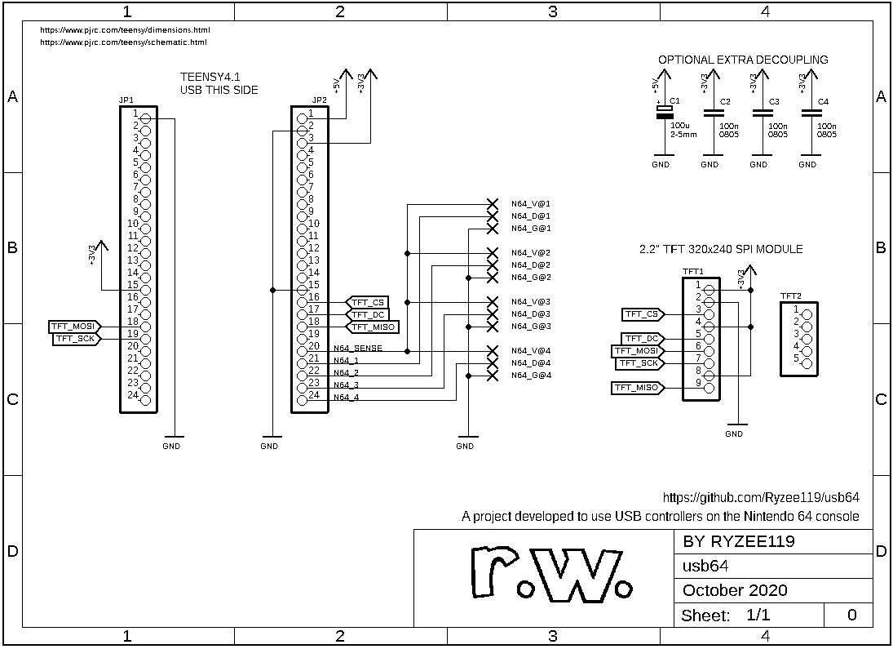

# Breakout PCB
* This board was designed using [Autodesk Eagle](https://www.autodesk.com/products/eagle/overview). You can edit the `.brd` and `.sch` with this program.
* You can order via KitSpace: https://kitspace.org/boards/github.com/ryzee119/usb64/.

